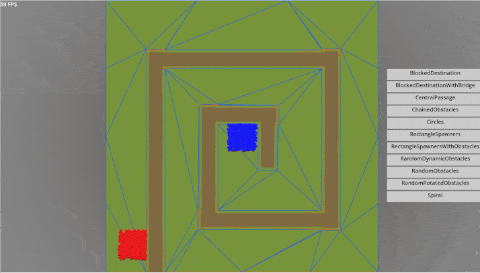
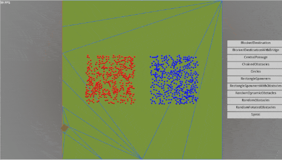
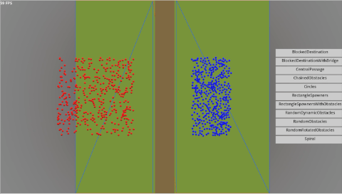
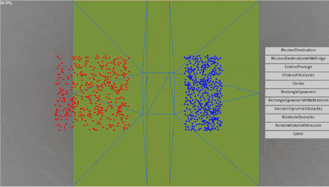
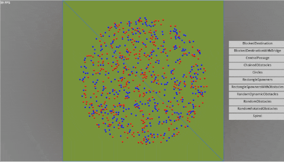
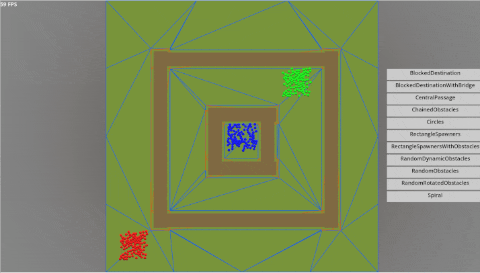
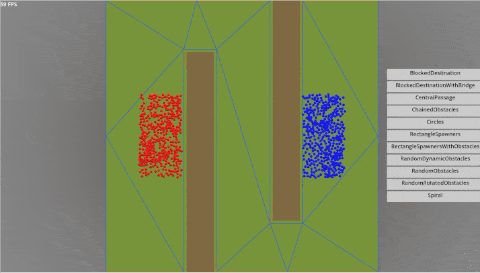
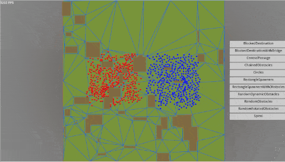
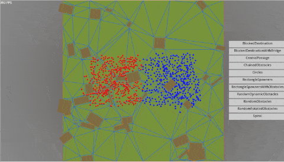

# 2D Navigation System (Godot C++)

This project contains implementation of the 2D navigation system which can be used for games or other visual 2D simulations. The system includes pathfinding, agents movement along their paths, agents local avoidance and obstacles of any shapes. The navigation system is navigation mesh based. The system benefits from fast constrained triangulation calculations when using derived and adapted Delaunator and Constrainautor libraries (see ThirdPartyNotices.md).

Note that this project used GDExtension and needs appropriate setup. So it is recommended for more advanced users who are looking for C++ performance. For beginners, it is recommended to start with Unity C# version of the project.

There are various example scenes set in the project to cover different kind of scenarios. Here are some examples of these.

Spiral - two streams of agents move around obstacles as these are alligned in a spiral pattern.

 

  

RandomDynamicObstacles - generates dynamic obstacles, rebuilds navigation mesh and moves agents all at once.

 

  

## More demos

  
BlockedDestination - two flows of agents blocked by a large obstacle in a middle.

   
  

    
  

  
BlockedDestinationWithBridge - similar to BlockedDestination but there is a bridge in a middle.

   
  

    
  

  
CentralPassage - agents distributed randomly in a circle tries to move to the corresponding position in the opposite side of the circle.

   
  

    
  

  
Circles - 3 layers of navmesh where each ring blocks navmesh areas completely.

   
  

    
  

  
RectangleSpawnersWithObstacles - two rectangular obstacles and agents moving around them.

   
  

    
  

  
RandomObstacles - similar to RandomDynamicObstacles but obstacles are static through simulation lifetime.

   
  

    
  

  
RandomRotatedObstacles - similar to RandomObstacles but obstacles randomly rotated.

   
  

    
  

